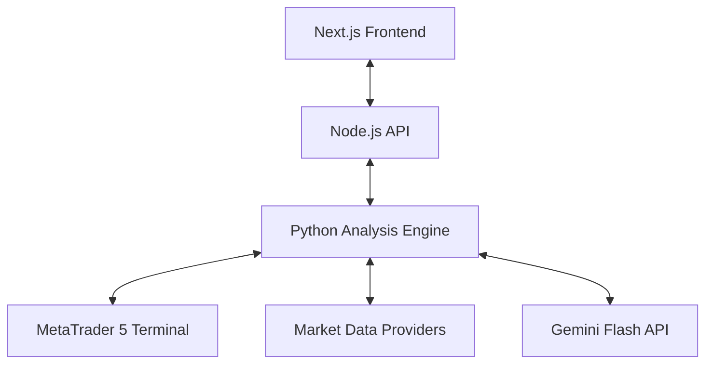

# Project Structure: FX Analyzer

## System Topology

## Directory Layout
- `/Docs`: Documentation (PRD, Architecture, Design)
- `/frontend`: Next.js web application
  - `/components`: UI units (Signals, Charts, TradePanel)
  - `/styles`: Global CSS and design tokens
- `/backend`: Node.js server for frontend-backend bridging
- `/engine`: Python core
  - `analyzer.py`: Technical analysis logic
  - `llm_analyzer.py`: LLM reasoning and sentiment analysis
  - `executor.py`: MetaTrader 5 execution logic
  - `data_feed.py`: Market data ingestion
- `/config`: System parameters and API keys
