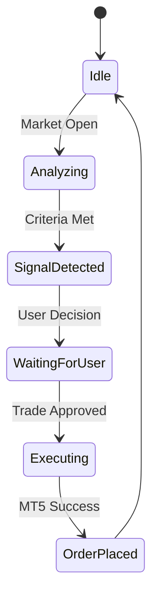

# UI/UX System: FX Analyzer

## Design Principles
- **Futuristic Premium:** High contrast, deep blacks, vibrant neons (Emerald for Buy, Ruby for Sell).
- **Dynamic Feedback:** Micro-animations on signal state changes.
- **Efficiency:** Single-view dashboard for all critical telemetry.

## Visual Hierarchy
1. **Ticker Bar:** Real-time prices across the top.
2. **Signal Grid:** High-accuracy signals with confidence scores.
3. **Execution Panel:** One-click order placement for active signals.
4. **Historical Log:** Recent trades and performance metrics.

## State Flow

## Inspiration
- Inspired by [21st.dev](https://21st.dev) for motion-rich components.
- Glassmorphism alternative: "Deep Neo" - solid dark backgrounds with vibrant glowing borders and depth shadows.
